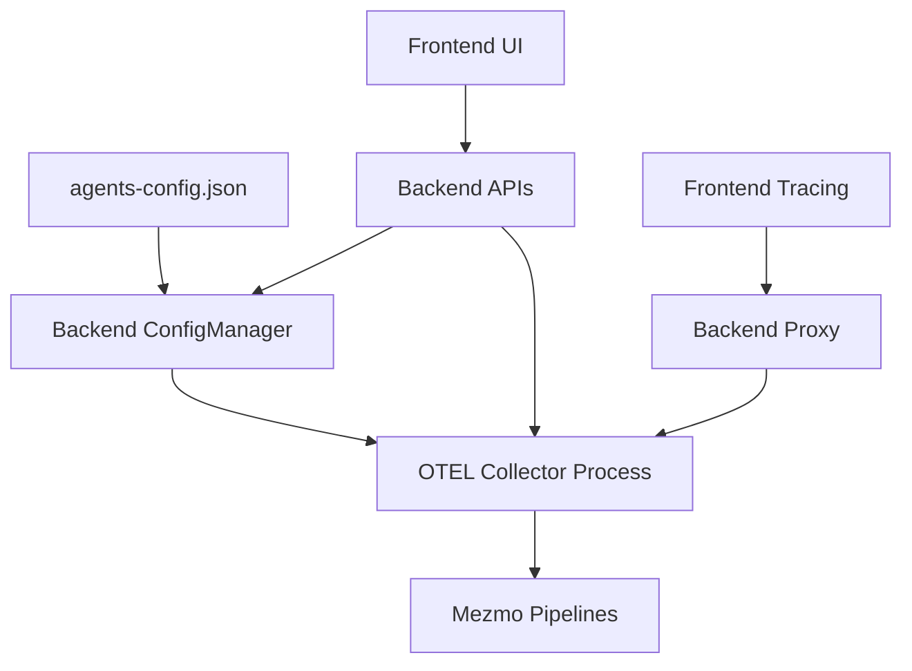

# OTEL Mezmo Integration Fix - Design Document

## Overview

This design document outlines the technical approach for fixing the OpenTelemetry (OTEL) integration with Mezmo in the restaurant application. The implementation will follow the exact patterns established by the working Mezmo agent integration, ensuring consistency in configuration management, process control, and user experience.

The core issue is that OTEL stopped working after migrating to the Node.js backend server architecture. The solution involves aligning OTEL's implementation with the proven Mezmo agent patterns, particularly around configuration file loading, server-side management, and process lifecycle control.

## Steering Document Alignment

### Technical Standards (tech.md)
- **Node.js Backend**: Utilizing Express.js for API endpoints and configuration management
- **React Frontend**: Following existing component patterns for the Agents page
- **Configuration Management**: JSON-based configuration with server-side storage
- **Process Management**: Controlled subprocess execution for OTEL Collector
- **Error Handling**: Graceful degradation with user-friendly error messages

### Project Structure (structure.md)
- **Server Components**: Located in `/server/services/` following existing patterns
- **Frontend Integration**: Extending `/src/pages/Agents.tsx` component
- **Configuration Files**: Using `/app/agents-config.json` for presets
- **API Routes**: Following existing `/api/otel/*` and `/api/config/*` patterns

## Code Reuse Analysis

### Existing Components to Leverage
- **ConfigManager** (`/server/services/configManager.js`): Already has OTEL configuration structure, needs proper initialization from config file
- **Agents Page** (`/src/pages/Agents.tsx`): Has working Mezmo implementation to mirror for OTEL
- **OTEL API Endpoints** (`/server/index.js`): Existing `/api/otel/*` routes need fixes
- **Frontend Tracing** (`/src/lib/tracing/`): Existing tracing implementation needs reconnection

### Integration Points
- **Configuration Loading**: Hook into existing `loadFileConfigurations()` pattern
- **Process Management**: Extend existing OTEL collector start/stop functions
- **Status Monitoring**: Use existing health check patterns from Mezmo agent
- **Backend Proxy**: Fix existing `/api/traces/v1/traces` proxy endpoint

## Architecture

The architecture follows a three-tier approach with clear separation of concerns:



### Configuration Flow
1. **File Loading**: agents-config.json → Backend ConfigManager → Server Storage
2. **UI Updates**: Frontend requests config → Backend returns merged config
3. **Process Control**: Configuration changes → Collector restart with new config
4. **Tracing Flow**: Frontend spans → Backend proxy → OTEL Collector → Mezmo

## Components and Interfaces

### Component 1: Configuration File Loader
- **Purpose:** Load OTEL configuration from agents-config.json file
- **Interfaces:** 
  - `GET /api/agents/configurations` - Returns file-based configurations
  - Config structure matches existing Mezmo pattern
- **Dependencies:** fs module, agents-config.json file
- **Reuses:** Existing file loading pattern from Mezmo implementation

### Component 2: Enhanced ConfigManager
- **Purpose:** Manage OTEL configuration with file preset support
- **Interfaces:**
  - `getConfig('otel')` - Returns merged configuration (file > storage > defaults)
  - `setConfig('otel', config)` - Updates server-side storage
  - `initializeFromFile(fileConfig)` - Populates defaults from config file
- **Dependencies:** Configuration file loader
- **Reuses:** Existing ConfigManager class structure

### Component 3: OTEL Collector Manager
- **Purpose:** Manage OTEL Collector process lifecycle
- **Interfaces:**
  - `/api/otel/start` - Start collector with current config
  - `/api/otel/stop` - Stop collector process
  - `/api/otel/status` - Get collector status and metrics
  - `/api/otel/configure` - Update collector configuration
- **Dependencies:** child_process, OTEL config generator
- **Reuses:** Existing OTEL management endpoints (need fixes)

### Component 4: Frontend OTEL Configuration UI
- **Purpose:** Provide UI for OTEL configuration matching Mezmo agent UX
- **Interfaces:**
  - Configuration preset selector
  - Pipeline configuration (logs/metrics/traces)
  - Status indicators and metrics display
- **Dependencies:** Backend OTEL APIs
- **Reuses:** Existing Agents.tsx component patterns

### Component 5: Tracing Proxy Fix
- **Purpose:** Proxy frontend traces to OTEL Collector
- **Interfaces:**
  - `POST /api/traces/v1/traces` - Receive frontend spans
  - Forward to OTEL Collector on port 4318
- **Dependencies:** OTEL Collector availability
- **Reuses:** Existing proxy endpoint (needs connection fixes)

## Data Models

### OTEL Configuration Model
```typescript
interface OtelConfig {
  enabled: boolean;
  serviceName: string;
  tags: string;
  pipelines: {
    logs: {
      enabled: boolean;
      ingestionKey: string;
      pipelineId: string;
      host: string;
    };
    metrics: {
      enabled: boolean;
      ingestionKey: string;
      pipelineId: string;
      host: string;
    };
    traces: {
      enabled: boolean;
      ingestionKey: string;
      pipelineId: string;
      host: string;
    };
  };
}
```

### Agent Configuration File Model
```typescript
interface AgentsConfigFile {
  defaultConfig: string;
  configurations: {
    [key: string]: {
      displayName: string;
      mezmo: MezmoConfig;
      otel: OtelConfig;
    };
  };
}
```

### OTEL Status Model
```typescript
interface OtelStatus {
  status: 'connected' | 'disconnected' | 'error';
  pid: number | null;
  enabledPipelines: {
    logs: boolean;
    metrics: boolean;
    traces: boolean;
  };
  metrics: {
    logsProcessed: number;
    metricsCollected: number;
    tracesReceived: number;
    errors: number;
    lastError: string | null;
  };
}
```

## Error Handling

### Error Scenarios

1. **Config File Missing or Invalid**
   - **Handling:** Fall back to server storage, then built-in defaults
   - **User Impact:** Warning message, but app continues with defaults

2. **OTEL Collector Fails to Start**
   - **Handling:** Retry with exponential backoff, show detailed error
   - **User Impact:** Status shows "error" with actionable message

3. **Pipeline Connection Failure**
   - **Handling:** Validate credentials, test connectivity, provide diagnostic info
   - **User Impact:** Specific error about which pipeline failed and why

4. **Frontend Tracing Initialization Failure**
   - **Handling:** Fail silently, log to console, don't impact app functionality
   - **User Impact:** No traces collected, but app works normally

5. **Collector Process Crash**
   - **Handling:** Detect via PID monitoring, update status, allow restart
   - **User Impact:** Status changes to "disconnected", restart button available

## Testing Strategy

### Unit Testing
- **ConfigManager Tests:** Verify file loading, merging, and storage
- **OTEL Config Generator:** Test YAML generation for different scenarios
- **Status Checking:** Verify health check and metrics collection
- **Error Handling:** Test all failure scenarios

### Integration Testing
- **End-to-End Config Flow:** File → Backend → UI → Collector
- **Process Management:** Start/stop/restart cycles
- **Pipeline Connectivity:** Test with real Mezmo endpoints
- **Frontend Tracing:** Verify spans reach Mezmo

### Manual Testing Checklist
- Load preset configurations from file
- Switch between environments (dev/int/prod)
- Enable/disable individual pipelines
- Verify metrics flow to Mezmo dashboard
- Test collector restart on config change
- Validate error messages for common issues

## Implementation Approach

### Phase 1: Configuration File Integration
1. Update agents-config.json with OTEL presets
2. Modify ConfigManager to load OTEL defaults from file
3. Implement configuration merging logic

### Phase 2: Fix Backend OTEL Management
1. Fix OTEL collector start/stop logic
2. Implement proper PID tracking
3. Fix configuration file generation
4. Improve error handling and status reporting

### Phase 3: Frontend UI Alignment
1. Update Agents.tsx OTEL section to match Mezmo patterns
2. Implement preset configuration support
3. Add read-only mode for preset values
4. Fix status indicators and metrics display

### Phase 4: Tracing Integration
1. Fix backend proxy endpoint
2. Update frontend tracing initialization
3. Add health checks before initialization
4. Implement graceful error handling

### Phase 5: Testing and Validation
1. Test all configuration scenarios
2. Verify data flow to Mezmo
3. Validate error handling
4. Document any remaining issues