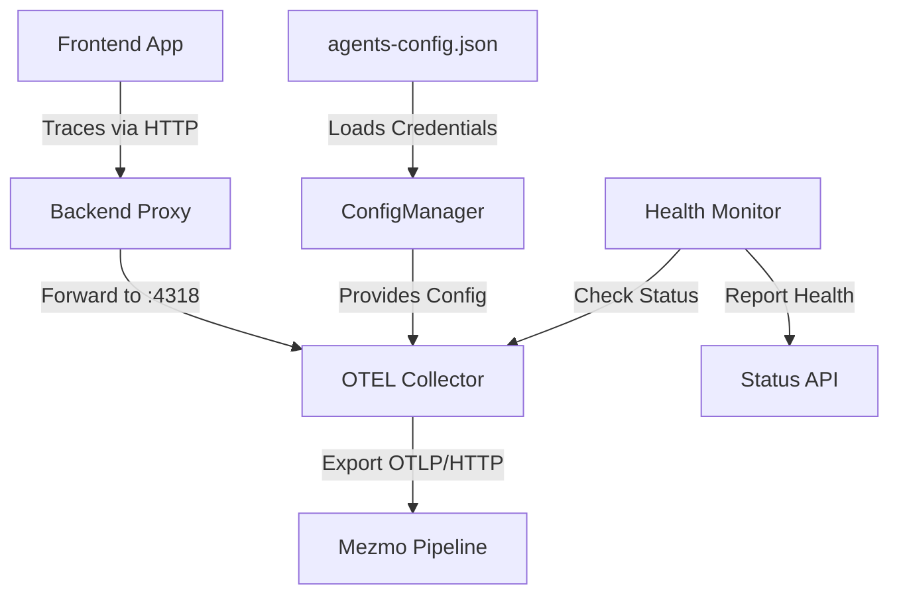

# Design Document

## Overview

This design addresses the broken OpenTelemetry (OTEL) traces integration with Mezmo pipelines. The system previously had functional trace collection but currently fails to export traces to Mezmo. The solution involves fixing the OTEL collector configuration to use the correct endpoint format and authentication, ensuring the backend proxy correctly forwards traces, and maintaining compatibility with existing log and metric pipelines. The implementation leverages the existing multi-pipeline architecture without requiring new components.

## Steering Document Alignment

### Technical Standards (tech.md)
The design follows documented technical patterns:
- **Integration Patterns**: Uses direct binary execution for OTEL collector management with file-based configuration
- **Error Handling**: Implements graceful degradation with user-friendly error messages when collector is unavailable
- **Performance Standards**: Maintains batch processing with 1024 trace batch size and 1-second timeout
- **Security Guidelines**: Keeps ingestion keys server-side only, never exposing them to frontend
- **Logging Standards**: Provides structured logging with debug file outputs for troubleshooting

### Project Structure (structure.md)
The implementation follows project organization conventions:
- **Backend Services**: Updates reside in `/app/server/index.js` and `/app/server/services/configManager.js`
- **Frontend Tracing**: Modifications in `/app/src/lib/tracing/config.ts`
- **Configuration**: Updates to `/app/agents-config.json` for trace pipeline credentials
- **Testing**: Enhanced tests in `/app/tests/otel-integration-tests.js`
- **File Naming**: Maintains existing file structure without introducing new files

## Code Reuse Analysis

### Existing Components to Leverage
- **generateOTELConfig Function**: Extend existing multi-pipeline configuration generator to correctly format trace endpoints
- **ConfigManager Service**: Use existing configuration management for trace pipeline settings
- **Backend Proxy Endpoint**: Fix existing `/api/traces/v1/traces` endpoint for proper forwarding
- **OTEL Status Monitoring**: Enhance existing `/api/otel/status` endpoint to report trace health

### Integration Points
- **OTEL Collector Binary**: Integrate with existing collector process management at port 4318
- **Frontend Tracing Library**: Leverage existing `@opentelemetry/exporter-trace-otlp-http` setup
- **Configuration Storage**: Use existing `agents-config.json` structure for trace credentials
- **Health Check System**: Extend existing collector health checks to validate trace export

## Architecture

The solution maintains the existing three-tier architecture for trace collection:

### Modular Design Principles
- **Single File Responsibility**: Trace configuration remains in dedicated tracing module
- **Component Isolation**: Trace proxy endpoint separate from other API endpoints
- **Service Layer Separation**: Configuration, proxy, and export layers remain distinct
- **Utility Modularity**: Trace health checks isolated from general health monitoring



## Components and Interfaces

### Component 1: OTEL Configuration Generator
- **Purpose:** Generate correct YAML configuration for OTEL collector with fixed trace export
- **Interfaces:** 
  - `generateOTELConfig(config)` - Returns YAML configuration object
  - Trace pipeline configuration with proper endpoint format
- **Dependencies:** ConfigManager for credentials, yaml library for serialization
- **Reuses:** Existing multi-pipeline configuration structure

### Component 2: Trace Proxy Endpoint
- **Purpose:** Forward frontend traces to OTEL collector avoiding CORS issues
- **Interfaces:**
  - `POST /api/traces/v1/traces` - Receives OTLP trace data
  - Forwards to `http://localhost:4318/v1/traces`
- **Dependencies:** OTEL collector availability, request forwarding
- **Reuses:** Existing proxy pattern from the endpoint

### Component 3: Trace Pipeline Configuration
- **Purpose:** Manage trace ingestion credentials and endpoint settings
- **Interfaces:**
  - ConfigManager trace pipeline properties
  - UI configuration for trace settings
- **Dependencies:** agents-config.json file structure
- **Reuses:** Existing pipeline configuration pattern

### Component 4: Frontend Trace Exporter
- **Purpose:** Send traces from browser to backend proxy
- **Interfaces:**
  - `initializeTracing()` - Initialize OTEL tracing
  - Export traces to backend proxy endpoint
- **Dependencies:** Backend proxy availability
- **Reuses:** Existing OTEL instrumentation setup

## Data Models

### Trace Pipeline Configuration
```typescript
interface TracePipelineConfig {
  enabled: boolean;
  ingestionKey: string;  // Base64 encoded key for Mezmo
  pipelineId: string;    // "5c7e0854-7705-11f0-b8ef-0260f52d7685"
  host: string;          // "pipeline.use.dev.logdna.net"
}
```

### OTEL Collector Trace Exporter
```yaml
otlphttp/traces:
  endpoint: "https://pipeline.use.dev.logdna.net/v1/5c7e0854-7705-11f0-b8ef-0260f52d7685"
  headers:
    authorization: "PCptnL3ukYQec5SEDGoC+zaU643ugfQHIGM6/YhGNfs="
    content-type: "application/x-protobuf"
  compression: gzip
  timeout: 30s
```

### Trace Proxy Request/Response
```typescript
interface TraceProxyRequest {
  body: Uint8Array;  // OTLP protobuf data
  headers: {
    'content-type': 'application/x-protobuf';
  }
}

interface TraceProxyResponse {
  success: boolean;
  message?: string;
  error?: string;
  details?: string;
}
```

## Error Handling

### Error Scenarios

1. **OTEL Collector Not Running**
   - **Handling:** Return 503 Service Unavailable from proxy
   - **User Impact:** Frontend logs warning, traces buffered locally

2. **Invalid Ingestion Key**
   - **Handling:** Log authentication error, update status endpoint
   - **User Impact:** Status shows trace export failure with auth error

3. **Network Timeout to Mezmo**
   - **Handling:** Implement retry with exponential backoff
   - **User Impact:** Temporary trace buffering, eventual delivery

4. **Malformed Trace Data**
   - **Handling:** Validate protobuf format before forwarding
   - **User Impact:** Error logged, trace dropped with notification

5. **Pipeline Endpoint Unreachable**
   - **Handling:** Fall back to debug file export
   - **User Impact:** Traces saved locally for debugging

## Testing Strategy

### Unit Testing
- Test `generateOTELConfig` produces correct trace exporter configuration
- Verify trace endpoint URL format includes pipeline ID
- Validate authorization header includes correct key
- Test configuration excludes traces when disabled

### Integration Testing
- Test trace flow from frontend through proxy to collector
- Verify collector successfully exports to Mezmo endpoint
- Test health status accurately reports trace pipeline state
- Validate configuration updates trigger collector restart

### End-to-End Testing
- Generate traces from UI interactions
- Verify traces appear in Mezmo pipeline dashboard
- Test trace continuity during collector restart
- Validate no impact on log and metric pipelines
- Load test with 1000 traces per second